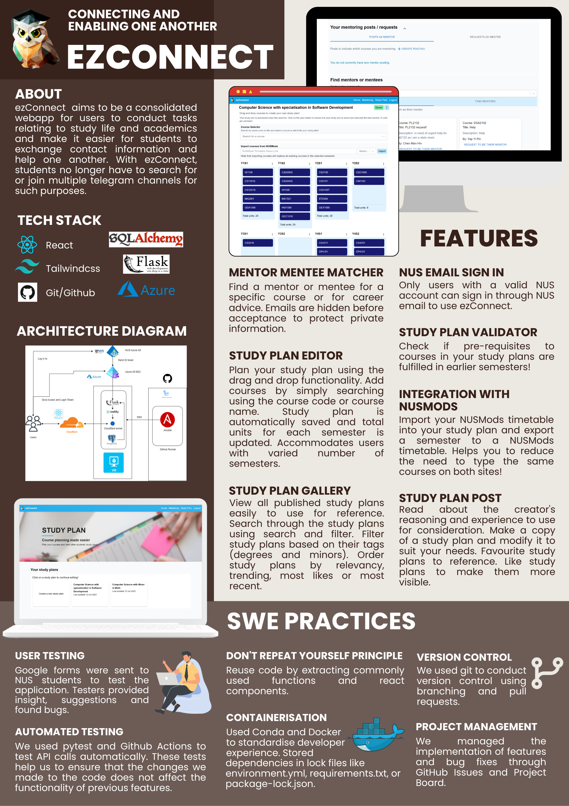

# EzConnect
By Camille Chin Rui Bin (rui_bin_chin@u.nus.edu) and Goh Li Ting (gohliting@u.nus.edu)

[Project README](ezConnect.pdf) (Documentation for Orbital, aka [CP2106](https://orbital.comp.nus.edu.sg/))

# Deployment Instructions (manual)

Remember to edit customisation, i.e. MSAL policies and domain names etc  

You may need to customise the [email sending script](backend/ezConnect/utils/emailer.py) for the
email provider you are using.  

If unclear, reference the instructions from the files in [infra](infra/), espicially the Ansible playbook

## Requirements  
- Docker  
- Node.js  
- Cloudflare account and domain (if using [cloudflare tunnels](https://www.cloudflare.com/products/tunnel/))  
Alternatively, expose caddy directly

0. Set environment variables, e.g. `MAILERCFW_API_KEY` and `CLOUDFLARED_SECRET`

1. In [frontend folder](frontend/), run `npm build`

2. Back in the base folder, run `sudo -E docker compose up`

# Local testing
Same requirements as before less the cloudflare account

```
cd backend
# Start database container
./setUpDB.sh
# Export env variables if needed
export APP_ENV=dev
export ...
# Start flask
flask run --debug
# Inside frontend, run
cd frontend
npm run start
```

# Project Poster
